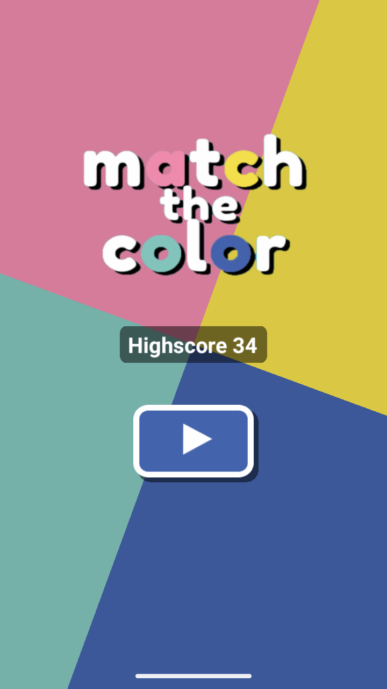
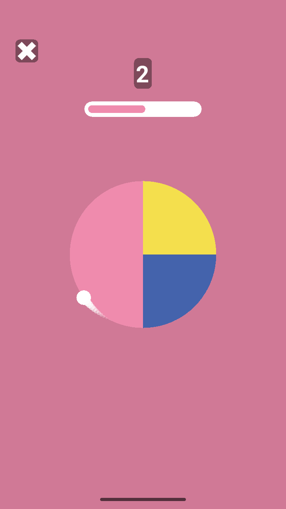
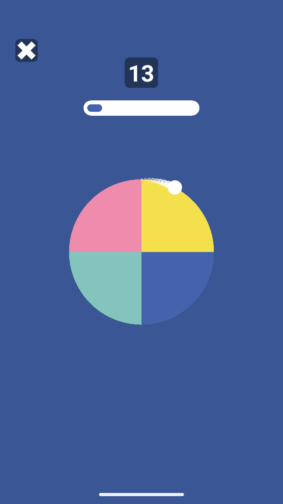

# Match the color

Match the color is a hyper casual mobile game made with Solar2D game engine and Lua-programming language.

    
    
    

The idea of the game is to tap the screen when the white circle is on a section that has the same color as the background in order to get points. When player gets a point, the speed of the white circle increases. The player loses when the time runs out or the player taps the screen in the wrong time.

The game was published to Google Play in June 2024, but I later removed it, since I didn't have the time to constantly update it. Note: The images above are from the "commercial" version of the game that was published on Google Play, which was derived from this project. The core mechanics and overall looks of the game are identical in both versions, but the "commercial" version has some updated assets, unfinished features and some commits I couldn't show publicly for security reasons.